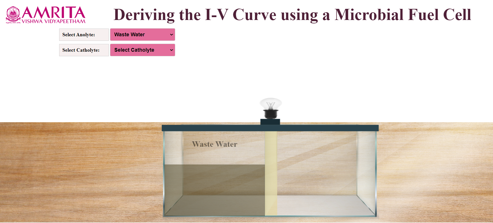
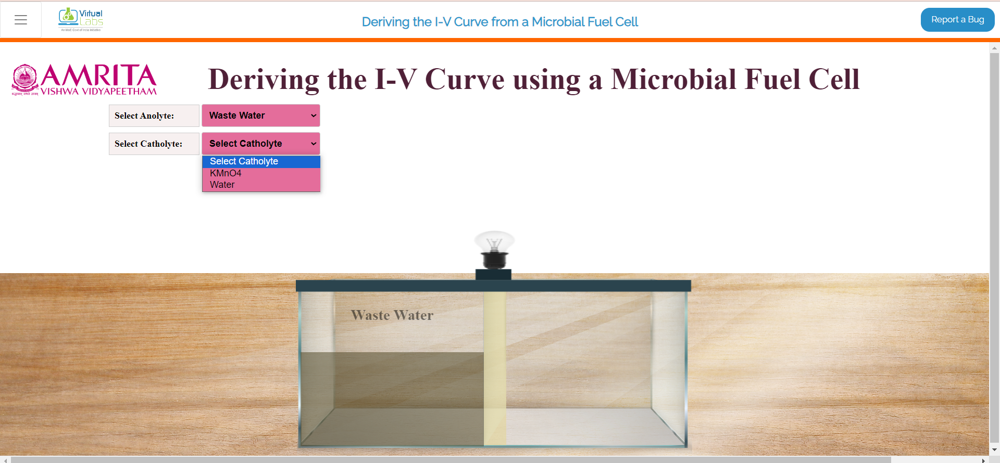
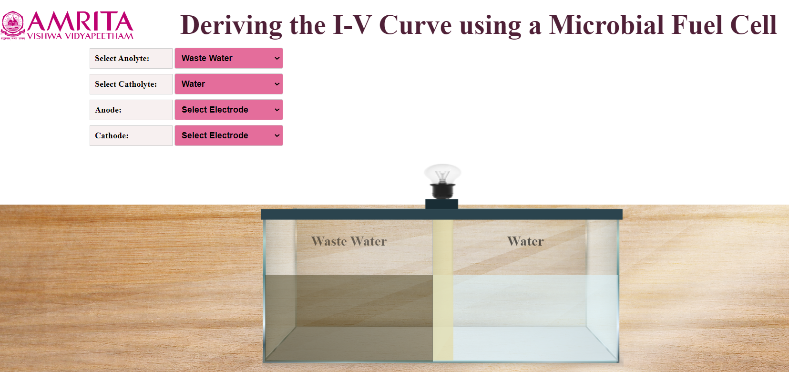
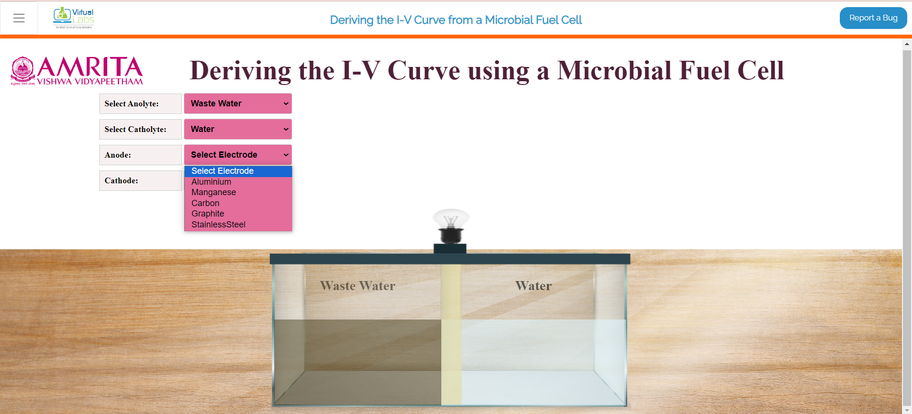
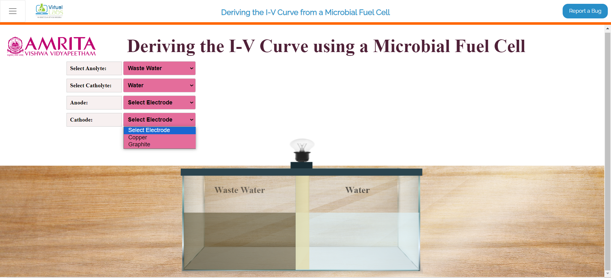
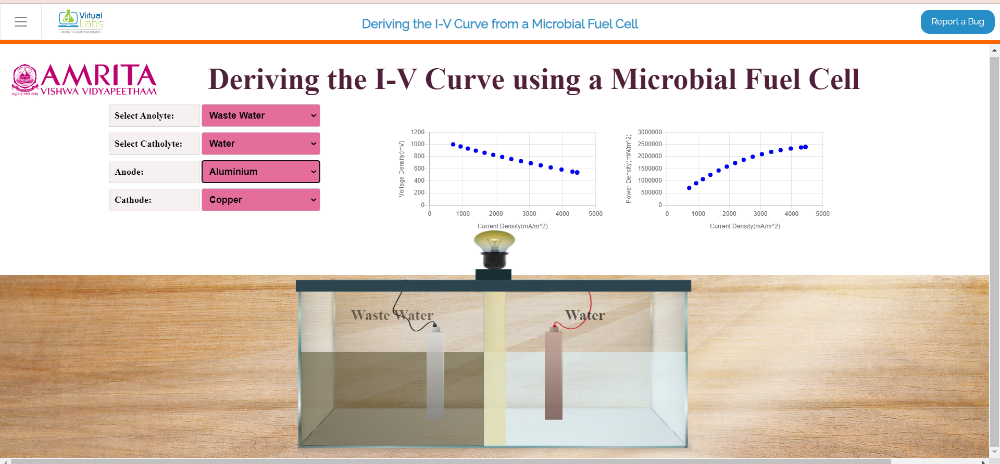
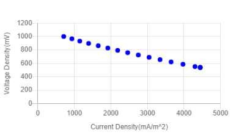
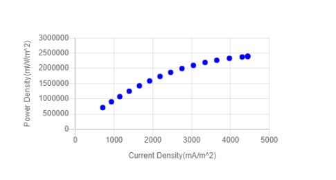
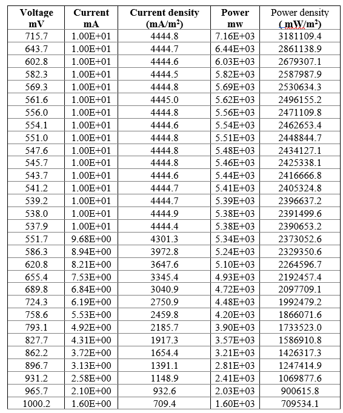

### Procedure

1.Users can open the simulator window. In the simulator window, input parameters Anolyte and Catholyte were provided. The design of a microbial fuel cell is also displayed. The anodic chamber (anolyte) is filled with wastewater.

&nbsp;

2.Users can choose either KMnO 4 or Water as Catholyte.

&nbsp;

 
3.Here, water is chosen as Catholyte. At the same time, users can select Anode and Cathode.
 

&nbsp;

4.As the anode, Aluminium, Manganese, Carbon, Graphite, and Stainless Steel were provided as options, and Copper and graphite were provided as options as Cathode. Users can select anode and cathode according to their choice.

 

&nbsp;

&nbsp;

5.Here, Anolyte is Wastewater, Catholyte is water, Anode is Aluminum and Cathode is Copper. After finishing the connections, the microorganisms in the wastewater (anolyte) consume the substrate and start producing current (milli ampere). As a result, users can see the electric bulb glowing in the system. At the same time, Current density(mA/m2) versus voltage (mV) and Current density versus power density (mW/m2) plots are displayed in the GUI. 

 

&nbsp;

&nbsp;

&nbsp;

The current and voltage were recorded daily. The Aluminium-Copper combination showed higher ISc (short-circuit current) and OCv (Open-circuit voltage) when compared to other electrode combinations. 

6.The table below represents the voltage, current density, and power density values of an MFC over a period using Nutrient agar as PEM. 

&nbsp;

The highest power density (3181109.4 mW/m2) was observed with an Aluminium-Copper combination of electrodes. The result also depends on the internal resistance of the electrode combinations. Aluminium-Copper has the least internal resistance compared to other electrodes. 

7.Similarly, the user can change the electrode combinations and proton exchange membrane (nutrient agar or Nafion) and can plot Current density(mA/m2) versus voltage (mV) and Current density versus power density (mW/m2) (simulator in progress). This helps to identify the best choice of electrodes and PEM to build an MFC on a laboratory scale.
