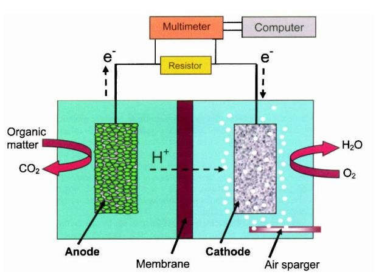
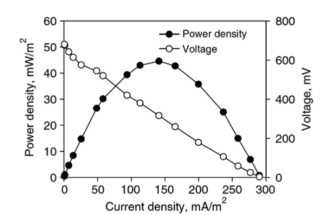
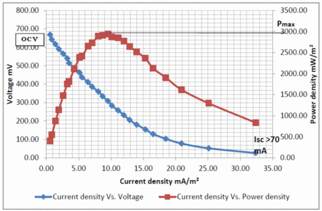

### Introduction

In today’s world, both industrial and domestic purposes focus on using electricity from non-renewable sources which may be leading to global energy crisis in the future. As an add on to this, research has been widening to devise technologies which employ alternate renewable energy sources. Efforts to use microorganisms to generate power from biodegradable waste materials (substrates) and organic wastes that were first illustrated by Dr. M. C. Potter, professor at the University of Durham in the UK, who depicted E. coli produced electricity using platinum electrodes and organic substrate and this led to the foundation of constructing primary microbial fuel cell. The maximum voltage recorded for this experimentation was 0.5V indicating the role of bacteria in generating electric current. Later from 1990s, MFCs were considered as promising technology, due to its low energy consumption and chemical usage and ample bioenergy production bridging the energy crisis with renewable energy thereby attaining sustainable goals in energy production with environmental safety.

&nbsp;

### Theory &nbsp;

Due to the increase in population and industrial development, there has been a significant rise in world power consumption where coal, oil, gas, and fossil fuels as the only dependent energy sources. This may pose not only energy-related issues but also environmental issues such as green house effect and ozone depletion. To overcome these issues, studies have been focusing on finding eco-friendly, sustainable, and reliable renewable energy sources with zero or minimal harm to the ecosystem. Microbial fuel cells are gaining attention in scientific community as it is a renewable and cost-effective approach for generating electricity without relying on fossil fuels. The design and construction of a typical microbial fuel cell in a laboratory condition is discussed in (link). This is thought to be a green approach in wastewater treatment, biosensors for water quality checking as it reduces methane gas production as microbes in MFC generate electrons for producing electrical signal (Fig.1). MFC’s are an evolving technology that produces lower power output when compared with other conventional energy sources that need further research and development for promising environmental outcomes. 

&nbsp;

 Fig.1. MFC as an evolving technology and green approach power generation and environmental benefits (Adapted from Malik, S., Kishore, S., Dhasmana, A., Kumari, P., Mitra, T., Chaudhary, V., ... & Rajput, V. D. (2023). A Perspective Review on Microbial Fuel Cells in Treatment and Product Recovery from Wastewater. Water, 15(2), 316)

Measuring the current production in a Microbial Fuel Cell (MFC) is a crucial step that determines the performance of the MFC. In a laboratory, polarization curves illustrate the current density as a function of voltage (the electric potential of the electrodes were plotted to study the efficiency of MFCs under different operating conditions. That is, a polarization curve is a graphical representation of the relationship between the electrical potential (voltage) and the current produced by the cell. To start functioning, in all typical MFCs, the anode in the anode compartment and the cathode in the cathode compartment were connected and electrolytes were added in both the chamber. To create a closed circuit for measuring the generated power, a load resistor is connected externally. The resistor simulates an electrical device that draws current from the MFC. The voltage generated by the MFC will cause current to flow through the circuit (Fig.2). Generally, a source meter is connected that can source a voltage and can measure current at the same time or it can source current and can measure the voltage at given time. For all MFCs, Ohm’s law was used to calculate the corresponding current.

&nbsp;

Ohm's law (I = V / R)

where:

I = current in Amperes (A),

V = voltage in Volts (V), 

R = resistance of the load or resistor in Ohms (Ω).

&nbsp;

By plotting current (I) against voltage (V), researchers can determine the voltage and current at which the MFC operates optimally and quantify the maximum power output. 

Current density was calculated as I = V/A, where V (mV) is the voltage and A (m2) the geometric surface area of the anode electrode. Power density (mW/m2) was calculated as P = IV

&nbsp;

Fig.2. Diagram of a microbial fuel cell with an open circuit for plotting polarization curve (Adapted from Abavisani, F., Mahdavi, M. A., & Gheshlaghi, R. (2019, July). Energy harvesting from microbial fuel cell using a power management system: A review. In Proceedings of the 3rd International Conference on Innovation and Research in Engineering Science, Tbilisi, Georgia (pp. 1-5). 

&nbsp;

In a power density graph, maximum points indicate the maximum power on the curve. Apart from changing the external resistance, potentiostat and voltammetry approaches were implicated in most cases of MFC. A potentiostat functions to regulate the voltage that exists between two electrodes. In linear sweep voltammetry technique, two electrodes have sweeping voltage at a constant pace that guage the current. This also helps to obtain the relationship between anode and cathode. The slope of the polarization curve indicates the internal resistance of MFC that has impact on maximum output of power generated. 

A polarization curve has two components: Anode polarization and Cathode Polarization. 

In anode polarization, the curve has a voltage drop as a function of current between an anode (the electrode where organic matter is oxidized by microorganisms) and a reference electrode. The factors that affect the voltage drop include electrochemical losses, mass transfer restrictions, and internal resistance. As the voltage at the anode drops, there is a gradual increase in the current. In the cathode electrode, the electrons unite with an electron acceptor, usually oxygen, and produce a polarization curve.  Voltage increase occurs at the cathode relative to the reference electrode in accordance with the current gain. Like the anode, the cathode polarization curve is also influenced by internal resistance, electrochemical losses, and mass transfer restrictions.

By plotting the anode and cathode polarization together, the overall cell voltage and power output at varying current densities can be calculated. The point of intersection of the two-polarization graph is indicative of Maximum Power Point, that is representative of the maximum power generated by the MFC. 

&nbsp;

&nbsp;

Fig.3. Polarization curve and power density plot of a microbial fuel cell with swine wastewater as substrate. (Adapted from: Ichihashi, O., Tada, C., & Nakai, Y. (2011). Power generation from animal wastewater using microbial fuel cell. J Integr Field Sci, 8, 13-20.)
 
&nbsp;

&nbsp;

Fig.4. Polarization curve an MFC system in a laboratory condition with graphite sheet as the electrodes and nafion membrane as PEM (Adapted from Madhavan, A., Prasad, M., Girish, S., Shetty, K. S., & Nair, B. (2017, December). Caulobacter crescentus as a novel exoelectricigen in a dual chambered microbial fuel cell (MFC). In 2017 International Conference on Technological Advancements in Power and Energy (TAP Energy) (pp. 1-4). IEEE.)

&nbsp;

As the polarization curve is indicative of performance of a MFC, in a laboratory condition it is crucial to analyze the efficiency of MFC, and to identify limitations in the design strategy there by reconstruction of MFC with maximum energy production. The research community has been constantly improving the reactor design and operating conditions (such as changing electrodes, substrate, and microorganisms) for obtaining maximum power output and MFC efficiency. The drawbacks of polarization curves included not providing information regarding stable operation of MFCs, and the maximum current density produced could not be stable for longer period. 
